# Taupy, Adventures in Math with Symbolic Programming


> Formulating a method as a computer-executable program and debugging that program is a powerful exercise in the learning process.
>
> — gjs

## Introduction

Math definitions concisely expressed with SymPy, a symbolic Python library.

## Calculus

### Sequence

#### Adjacent Sequence

Two adjacent sequences converge and have the same limit.

```python
from sympy import *

n = symbols("n")

un = 1 - 1 / n
vn = 1 + 1 / n

is_adjacent = limit(un - vn, n, oo).doit() == 0
assert is_adjacent

is_same_limit = limit(un, n, oo).doit() == limit(vn, n, oo).doit()
assert is_same_limit
```

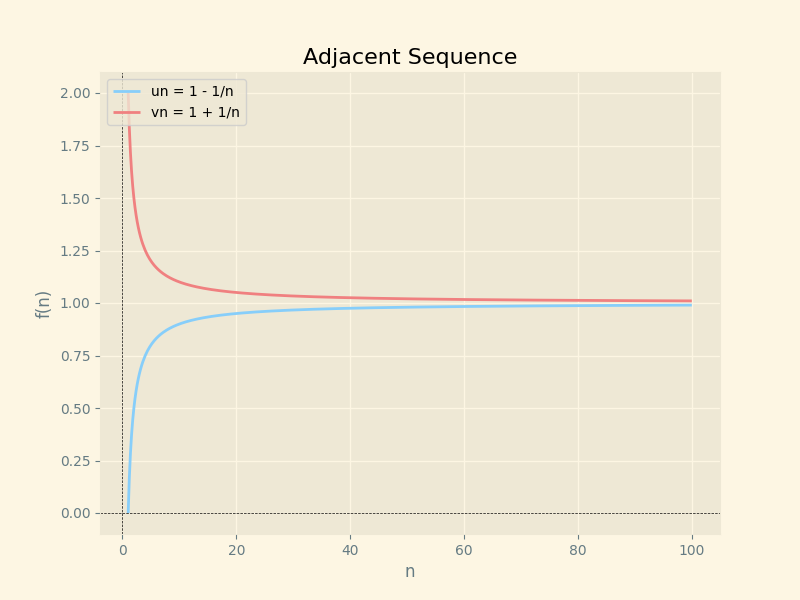

#### Cauchy Sequence

A set is complete if and only if every Cauchy sequence converges within it, hence Q is not complete.

```python
from sympy import *

n = symbols("n")

cauchy_sequence_limit = summation(1 / factorial(n), (n, 0, oo))

is_limit_not_in_Q = cauchy_sequence_limit == E
assert is_limit_not_in_Q
```

#### Cesaro Mean

When a sequence has a limit the Cesaro mean has the same limit.

```python
from sympy import *

n = symbols("n")

expression = n * log(1 + 2 / n)
sequence_limit = limit(expression, n, oo).doit()

cesaro_mean = 0
N = 1000
for i in range(1, N):
    cesaro_mean += expression.subs({n: i})
cesaro_mean /= N

is_same_limit = abs(cesaro_mean.evalf() - sequence_limit) < 0.02
assert is_same_limit
```

#### Recursive Sequence

The set of solutions to a second-order constant-recursive sequence is a vector space.

```python
from sympy import *

r, un1, un, n, c, d = symbols("r un1 un n c d")

a = -4
b = -3

un2 = a * un1 + b * un
characteristic_equation_of_un2 = r**2 - a * r - b
solutions = solve(characteristic_equation_of_un2, r)

set_of_solutions = c * solutions[0] ** n + d * solutions[1] ** n

u0 = set_of_solutions.subs({c: 50, d: 100, n: 0})
u1 = set_of_solutions.subs({c: 50, d: 100, n: 1})
u2 = un2.subs({un1: u1, un: u0})
is_solution = u2 == set_of_solutions.subs({c: 50, d: 100, n: 2})
assert is_solution

mu = 2
u10 = set_of_solutions.subs({c: 50, d: 100, n: 10})
u10_prime = set_of_solutions.subs({c: -50, d: -100, n: 10})
v10 = set_of_solutions.subs({c: 60, d: 110, n: 10})
w10 = set_of_solutions.subs({c: 70, d: 150, n: 10})
neutral_zero = set_of_solutions.subs({c: 0, d: 0, n: 10})
neutral_one = set_of_solutions.subs({c: 0, d: 1, n: 10})

is_associative = (
    (u10 + v10) + w10
    == u10 + (v10 + w10)
    == set_of_solutions.subs({c: 50 + 60 + 70, d: 100 + 110 + 150, n: 10})
)
is_commutative = (
    (u10 + v10)
    == (v10 + u10)
    == set_of_solutions.subs({c: 50 + 60, d: 100 + 110, n: 10})
)
is_distributive = (
    mu * (u10 + v10)
    == mu * u10 + mu * v10
    == set_of_solutions.subs({c: mu * (50 + 60), d: mu * (100 + 110), n: 10})
)
is_symmetry = u10 + u10_prime == neutral_zero
is_neutral_add = u10 + neutral_zero == u10
is_neutral_mult = u10 * neutral_one == u10

is_vector_space = (
    is_associative
    and is_commutative
    and is_distributive
    and is_symmetry
    and is_neutral_add
    and is_neutral_mult
)
assert is_vector_space
```

### Integral

#### Signal Value

The mean value of a signal is the integral of its amplitude over time divided by the duration.

```python
from sympy import *

t = symbols("t")

f = sin(t) ** 2

t1 = 0
t2 = 2 * pi

mean_value = integrate(f, (t, t1, t2)) / (t2 - t1)

is_compliant_with_plot = abs(mean_value - 0.5) < 0.001
assert is_compliant_with_plot
```

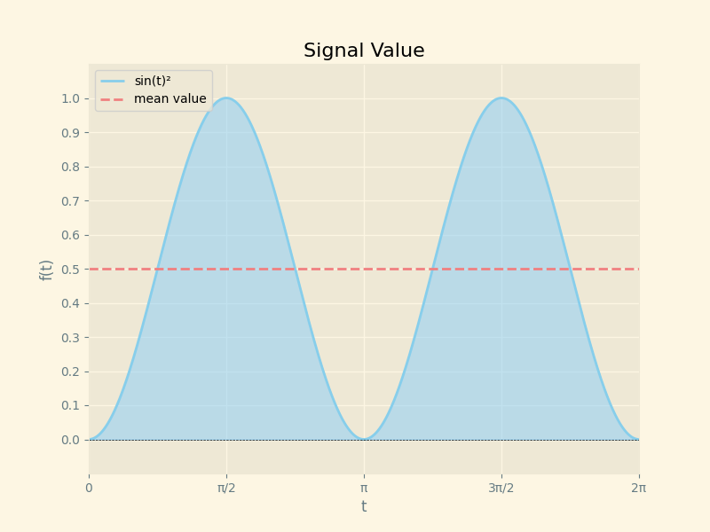

#### Convolution Operator

The convolution operator combines two functions by integrating the product of one function with a shifted and reversed version of the other.

```python
from sympy import *

x, t = symbols("x t")

rectangular_function_f = Piecewise((1, And(t >= -1 / 2, t <= 1 / 2)), (0, True))
shifted_rectangular_function_g = Piecewise(
    (1, And(x - t >= -1 / 2, x - t <= 1 / 2)), (0, True)
)
convolution_f_g = integrate(
    rectangular_function_f * shifted_rectangular_function_g, (t, -oo, oo)
)

is_compliant_with_plot = all(
    [
        convolution_f_g.subs({x: -0.25}) == 0.75,
        convolution_f_g.subs({x: 0}) == 1.0,
        convolution_f_g.subs({x: 0.25}) == 0.75,
        convolution_f_g.subs({x: 0.5}) == 0.5,
        convolution_f_g.subs({x: 1}) == 0,
    ]
)
assert is_compliant_with_plot
```

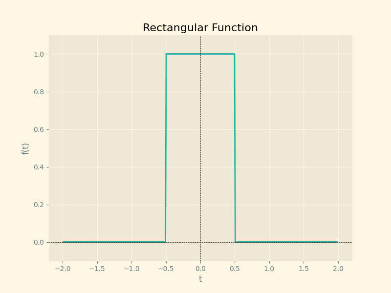
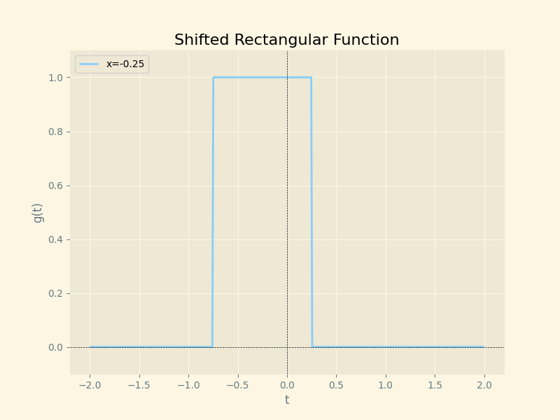
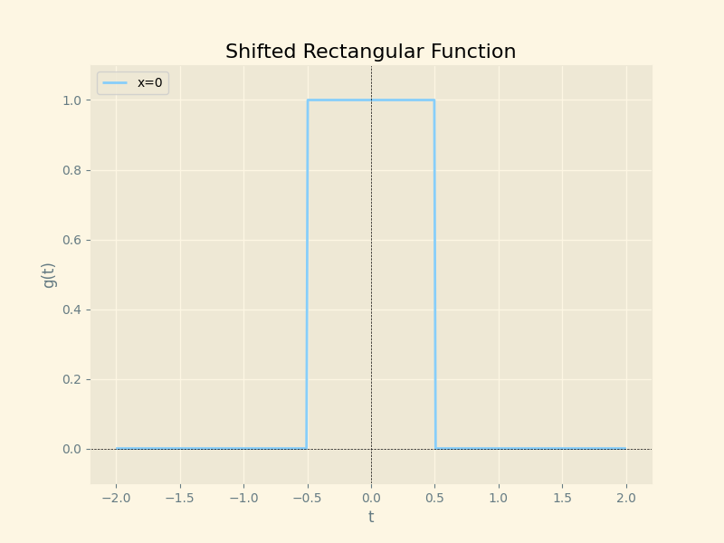
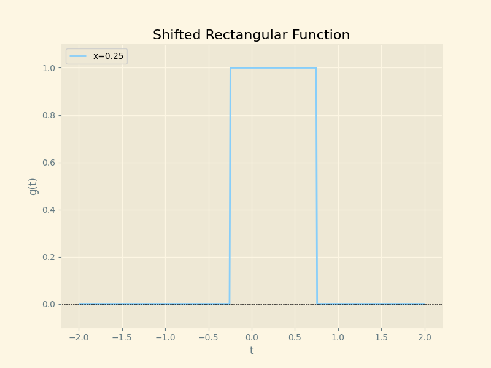
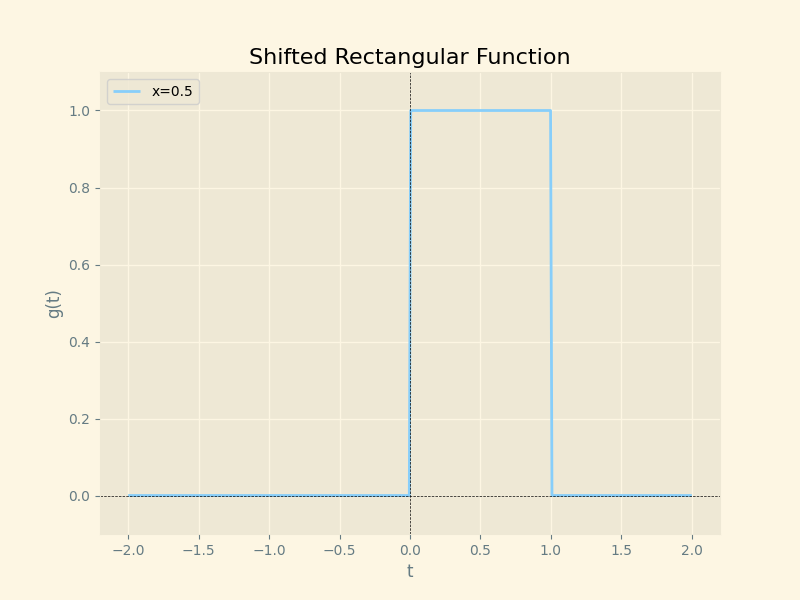
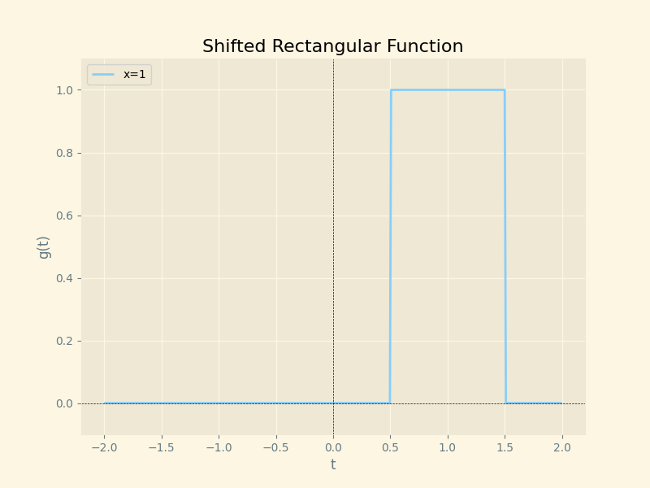
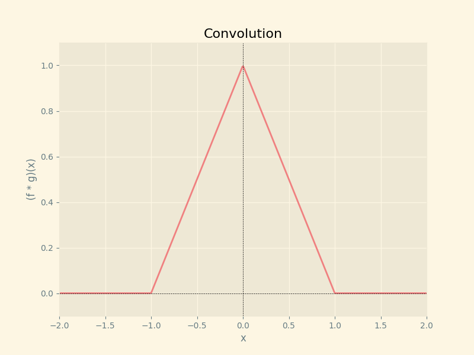

#### Cauchy Principal

The Cauchy principal value assigns values to certain improper integrals that would otherwise be undefined.

```python
from sympy import *

x = symbols("x")
r, epsilon = symbols("r epsilon", positive=True)

f = 1 / x

is_undefined = integrate(f, (x, -oo, oo)) == nan
assert is_undefined

undefined_at_x = 0

cauchy_principal_value = simplify(
    integrate(f, (x, -r, undefined_at_x - epsilon))
    + integrate(f, (x, undefined_at_x + epsilon, r))
)

is_defined = cauchy_principal_value != nan
assert is_defined
```

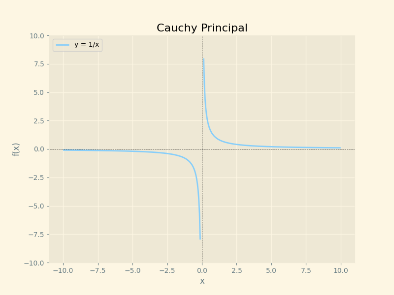

#### Jacobian Determinant

The determinant of the Jacobian matrix provides the scaling factor that adjusts the integral to the new coordinate system.

```python
from sympy import *

x, y, r, theta = symbols("x y r theta")

xp = r * cos(theta)
yp = r * sin(theta)

jacobian_matrix = Matrix(
    [[diff(xp, r), diff(xp, theta)], [diff(yp, r), diff(yp, theta)]]
)
jacobian_polar_factor = det(jacobian_matrix).simplify()

integrate_fxy_in_unit_circle_region_polar = integrate(
    (xp - yp) ** 2 * jacobian_polar_factor, (r, 0, 1), (theta, 0, 2 * pi)
)

integrate_fxy_in_unit_circle_region_cartesian = integrate(
    (x - y) ** 2, (y, -sqrt(1 - x**2), sqrt(1 - x**2)), (x, -1, 1)
)

is_same_area = (
    integrate_fxy_in_unit_circle_region_polar
    == integrate_fxy_in_unit_circle_region_cartesian
    == pi / 2
)
assert is_same_area
```

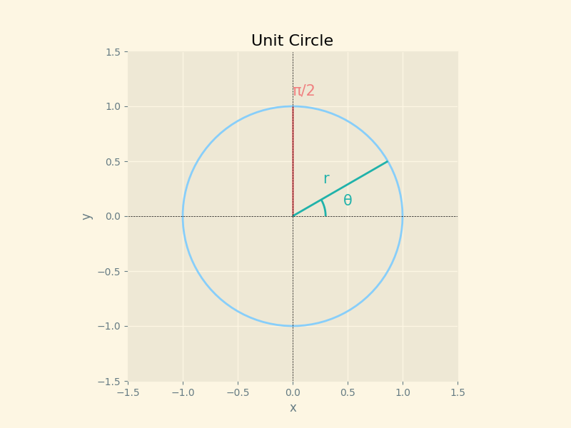

### Approximation & Interpolation

#### Newton's Method

Newton's method is an iterative technique for finding the roots of a function by using successive approximations.

```python
from sympy import *

x = symbols("x")

f = x**2 - 4
Df = diff(f, x)

x0 = 10
x1 = x0 - f.subs({x: x0}) / Df.subs({x: x0})
x2 = x1 - f.subs({x: x1}) / Df.subs({x: x1})
x3 = x2 - f.subs({x: x2}) / Df.subs({x: x2})

tangent_at_x0 = f.subs({x: x0}) + Df.subs({x: x0}) * (x - x0)

is_compliant_with_plot = all(
    [
        x0 == 10,
        abs(x1 - 5.2) < 0.01,
        abs(x2 - 2.984) < 0.01,
        abs(x3 - 2.162) < 0.01,
        tangent_at_x0.subs({x: x1}) == 0,
    ]
)
assert is_compliant_with_plot
```

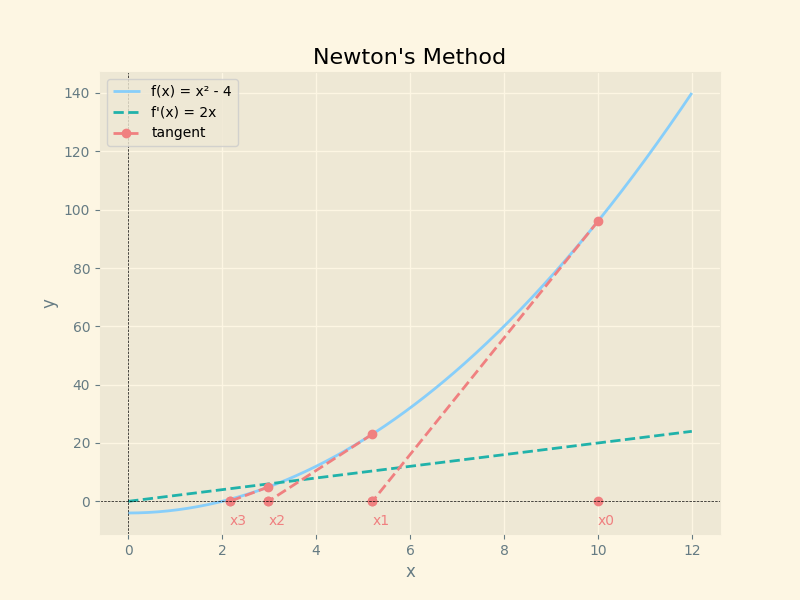

#### Ordinary Least Squares

Ordinary Least Squares finds the best-fitting line by minimizing prediction errors across data points.

```python
from sympy import *

x1, x2 = symbols("x1 x2")
c1 = 3
c2 = 2
c3 = 5

f = c1 + c2 * x1 + c3 * x2

X = Matrix([[1, 0, 1], [1, 1, 2], [1, 2, 3], [1, 3, 5], [1, 4, 7]])
y = Matrix(
    [
        f.subs({x1: 0, x2: 1}),
        f.subs({x1: 1, x2: 2}),
        f.subs({x1: 2, x2: 3}),
        f.subs({x1: 3, x2: 5}),
        f.subs({x1: 4, x2: 7}),
    ]
)

beta_hat = (X.T * X).inv() * X.T * y
y_hat = X * beta_hat

is_good_estimator = beta_hat == Matrix([[c1], [c2], [c3]]) and y_hat == y
assert is_good_estimator
```

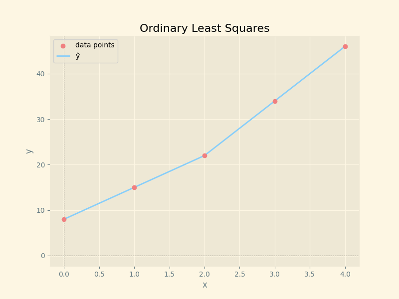

#### Lagrange Polynomial

Lagrange polynomial interpolates a set of points by combining simpler polynomial terms.

```python
from sympy import *

x = symbols("x")

f = x**3 - 2 * x - 5

x0 = 0.5
y0 = f.subs({x: x0})
x1 = 2.0
y1 = f.subs({x: x1})
x2 = 3.5
y2 = f.subs({x: x2})

lagrange_basis = [
    ((x - x1) * (x - x2)) / ((x0 - x1) * (x0 - x2)),
    ((x - x0) * (x - x2)) / ((x1 - x0) * (x1 - x2)),
    ((x - x0) * (x - x1)) / ((x2 - x0) * (x2 - x1)),
]

lagrange_polynomial = (
    y0 * lagrange_basis[0] + y1 * lagrange_basis[1] + y2 * lagrange_basis[2]
)

is_compliant_with_plot = all(
    [
        abs(lagrange_polynomial.subs({x: x0}) + 5.875) < 0.01,
        abs(lagrange_polynomial.subs({x: x1}) + 1.0) < 0.01,
        abs(lagrange_polynomial.subs({x: x2}) - 30.875) < 0.01,
    ]
)
assert is_compliant_with_plot
```

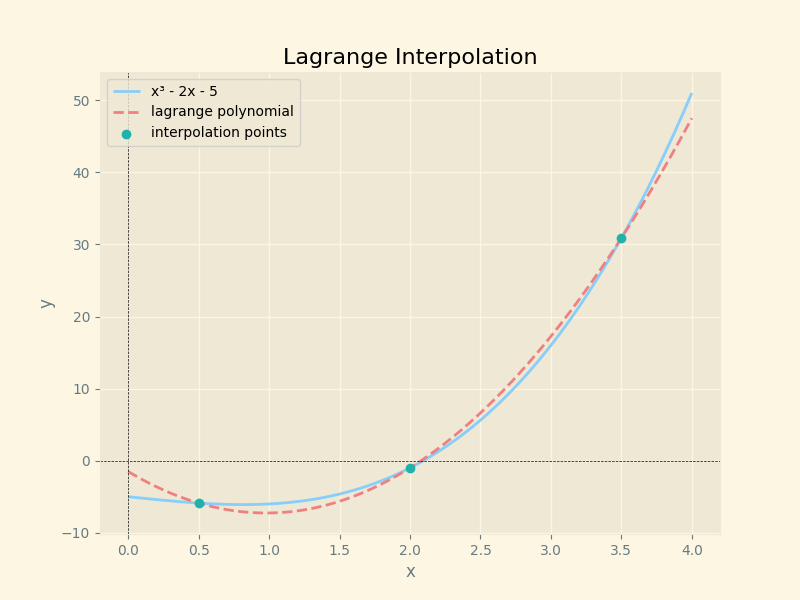

#### Chebyshev Nodes

Chebyshev nodes are the roots of Chebyshev polynomials used for optimal polynomial interpolation.

```python
from sympy import *

x, k, n, a, b = symbols("x k n a b")

f = x**3 - 2 * x - 5

theta = acos(x)
chebyshev_polynomial = cos(n * theta)

chebyshev_polynomial_definition = (
    cos(0) == 1
    and cos(theta) == x
    and simplify(cos(2 * theta) - (2 * cos(theta) ** 2 - 1)) == 0
    and 2 * cos(theta) ** 2 - 1
    == 2 * x**2 - 1
    == 2 * x * chebyshev_polynomial.subs({n: 1}) - chebyshev_polynomial.subs({n: 0})
    and integrate(
        chebyshev_polynomial.subs({n: 1})
        * chebyshev_polynomial.subs({n: 2})
        / sqrt(1 - x**2),
        (x, -1, 1),
    )
    == 0
)
assert chebyshev_polynomial_definition

chebyshev_node = (a + b) / 2 + ((b - a) / 2) * cos((2 * k + 1) / (2 * n) * pi)
chebyshev_node3 = [
    chebyshev_node.subs({k: 0, n: 3, a: -1, b: 1}),
    chebyshev_node.subs({k: 1, n: 3, a: -1, b: 1}),
    chebyshev_node.subs({k: 2, n: 3, a: -1, b: 1}),
]

t3 = chebyshev_polynomial.subs({n: 3})
is_t3_roots = (
    t3.subs({x: chebyshev_node3[0]})
    == t3.subs({x: chebyshev_node3[1]})
    == t3.subs({x: chebyshev_node3[2]})
    == 0
)
assert is_t3_roots

x0 = chebyshev_node.subs({k: 0, n: 3, a: 0, b: 4})
y0 = f.subs({x: x0})
x1 = chebyshev_node.subs({k: 1, n: 3, a: 0, b: 4})
y1 = f.subs({x: x1})
x2 = chebyshev_node.subs({k: 2, n: 3, a: 0, b: 4})
y2 = f.subs({x: x2})

lagrange_basis = [
    ((x - x1) * (x - x2)) / ((x0 - x1) * (x0 - x2)),
    ((x - x0) * (x - x2)) / ((x1 - x0) * (x1 - x2)),
    ((x - x0) * (x - x1)) / ((x2 - x0) * (x2 - x1)),
]

lagrange_chebyshev_polynomial = (
    y0 * lagrange_basis[0] + y1 * lagrange_basis[1] + y2 * lagrange_basis[2]
)

is_compliant_with_plot = all(
    [
        abs(lagrange_chebyshev_polynomial.subs({x: x0}) - 39.517) < 0.01,
        abs(lagrange_chebyshev_polynomial.subs({x: x1}) + 1.0) < 0.01,
        abs(lagrange_chebyshev_polynomial.subs({x: x2}) + 5.517) < 0.01,
    ]
)
assert is_compliant_with_plot
```

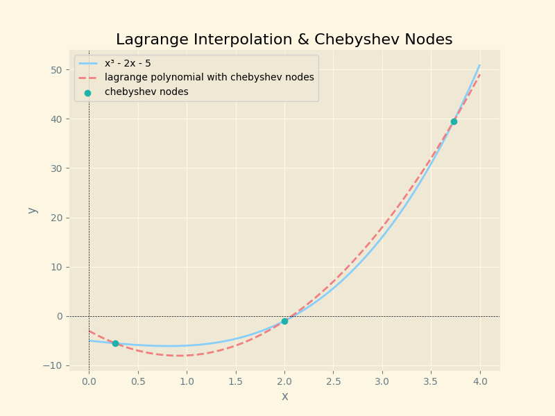
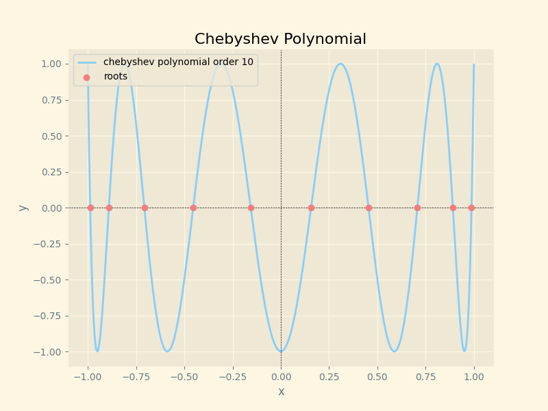

## Algebra

### Matrix

#### Rank & Dimension

The rank of a matrix is the dimension of the vector space generated by its columns.

```python
from sympy import *

R3_dim = 3

A = Matrix([[1, 0, 1], [0, 1, 1], [0, 1, 1]])

is_linearly_independent = A.shape[1] == A.rank()
is_R3_dim = R3_dim == A.rank()
assert not is_linearly_independent
assert not is_R3_dim

B = Matrix([[1, 0, 0], [0, 1, 0], [0, 0, 1]])

is_linearly_independent = B.shape[1] == B.rank()
is_R3_dim = R3_dim == B.rank()
assert is_linearly_independent
assert is_R3_dim
```

#### Invertible Matrix

A matrix is invertible if and only if its determinant is non-zero,
moreover its cofactor matrix is also involved in the formula for calculating its inverse.

```python
from sympy import *

A = Matrix([[2, 1], [1, 2]])

det_A = A.det()

is_invertible = A.det() != 0
assert is_invertible

adjugate_matrix = A.cofactor_matrix().T

is_inverse = A * (adjugate_matrix / det_A) == eye(2)
assert is_inverse
```

#### Characteristic Polynomial

Eigenvalues of a matrix are the roots of the characteristic polynomial and are used in the eigendecomposition.

```python
from sympy import *

X = symbols("X")

A = Matrix([[4, 1], [2, 3]])
characteristic_polynomial = (A - X * eye(2)).det()
eigenvalues = A.eigenvals()

is_roots = roots(characteristic_polynomial) == eigenvalues
assert is_roots

eigenvalue, _, eigenvectors = A.eigenvects()[0]
eigenvector = eigenvectors[0]

is_eigendecomposition = (A * eigenvector) == (eigenvalue * eigenvector)
assert is_eigendecomposition
```

#### Kernel & Linear Map

A linear map is injective if and only if its kernel contains only the zero vector.

```python
from sympy import *

x, y = symbols("x y")

u = Matrix([x, y])
zero_vector = Matrix([0, 0])
linear_map = Matrix([[1, 1], [1, -1]])

kernel = solve(Eq(linear_map * u, zero_vector), (x, y))

is_only_zero_vector = kernel[x] == kernel[y] == 0
assert is_only_zero_vector
```

### Normed Vector Space

#### Unit Vector

The normalized vector of a non-zero vector is the unit vector in the same direction.

```python
from sympy import *

vector = Matrix([1, 2, 3])
unit_vector = Matrix([1, 0, 0])

is_unit_vector = unit_vector.norm() == 1
assert is_unit_vector

normalized_vector = vector / vector.norm()

is_unit_vector = normalized_vector.norm() == 1
assert is_unit_vector
```

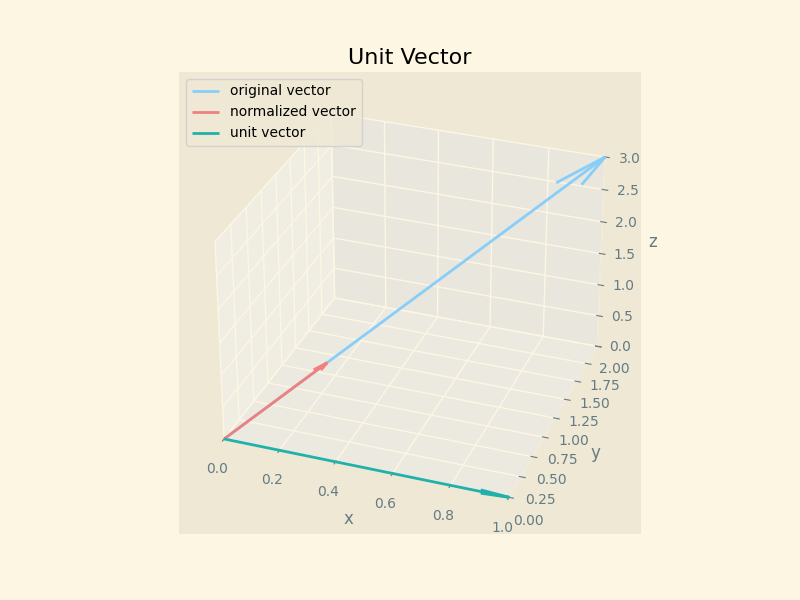

#### Unit Ball

In two-dimensional space, balls of radius one have different shapes depending on the associated distance.

```python
from sympy import *

a, r, x0, x1 = symbols("a r x0 x1")

manhattan_distance = abs(x0 - a) + abs(x1 - a)
euclidean_distance = sqrt((x0 - a) ** 2 + (x1 - a) ** 2)
infinity_distance = Max(abs(x0 - a), abs(x1 - a))

manhattan_ball_eq = manhattan_distance <= r
is_compliant_with_plot = manhattan_ball_eq.subs({a: 0, r: 1}) == (
    abs(x0) + abs(x1) <= 1
)
assert is_compliant_with_plot

euclidean_ball_eq = euclidean_distance <= r
is_compliant_with_plot = euclidean_ball_eq.subs({a: 0, r: 1}) == (
    sqrt(x0**2 + x1**2) <= 1
)
assert is_compliant_with_plot

infinity_ball_eq = infinity_distance <= r
is_compliant_with_plot = infinity_ball_eq.subs({a: 0, r: 1}) == (
    Max(abs(x0), abs(x1)) <= 1
)
assert is_compliant_with_plot
```

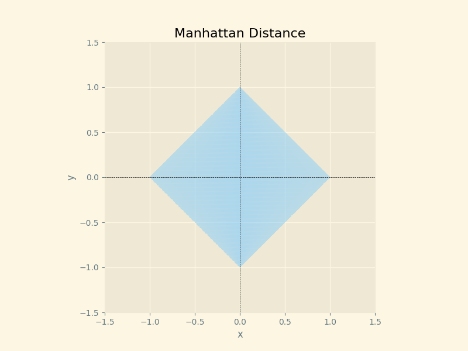
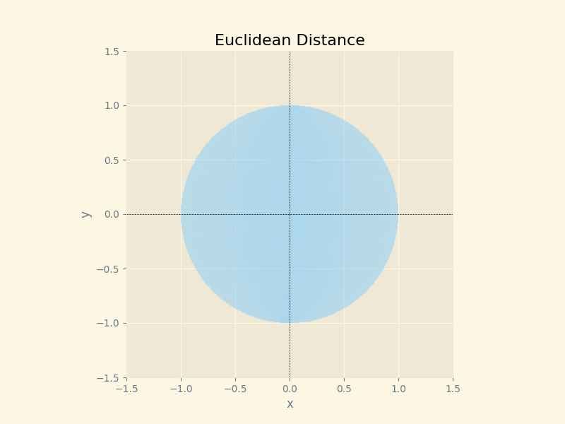
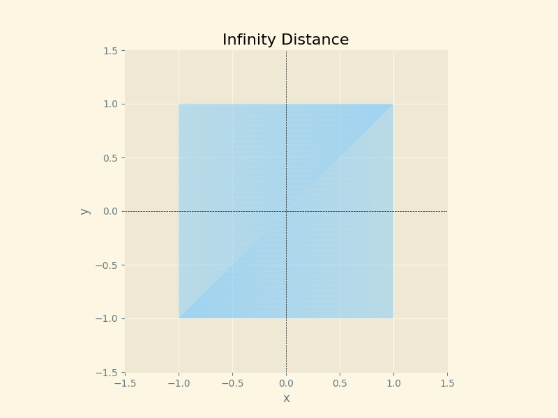

#### Matrix Norm

The space of square matrices with a sub-multiplicative norm is a Banach algebra.

```python
from sympy import *

c1, c2, c3, c4 = symbols("c1 c2 c3 c4")

E1 = Matrix([[1, 0], [0, 0]])
E2 = Matrix([[0, 1], [0, 0]])
E3 = Matrix([[0, 0], [1, 0]])
E4 = Matrix([[0, 0], [0, 1]])

equation = c1 * E1 + c2 * E2 + c3 * E3 + c4 * E4
solution = solve([equation[i, j] for i in range(2) for j in range(2)], (c1, c2, c3, c4))

is_linearly_independent = all(val == 0 for val in solution.values())
is_finite_dimension = is_linearly_independent
assert is_finite_dimension

is_norm_exist = E1.norm
is_banach_space = is_finite_dimension and is_norm_exist
assert is_banach_space

A = Matrix([[1, 2], [3, 4]])
B = Matrix([[5, 6], [7, 8]])

is_sub_multiplicative_norm = (A * B).norm(1) <= A.norm(1) * B.norm(1)
assert is_sub_multiplicative_norm

is_banach_algebra = is_banach_space and is_sub_multiplicative_norm
assert is_banach_algebra
```

#### Orthogonal Projection

An orthogonal projection is a projector whose kernel and image are orthogonal.

```python
from sympy import *

u = Matrix([1, 2])
v = Matrix([3, 4])

orthogonal_projection = v * (v.T * v).inv() * v.T

is_projection = orthogonal_projection == orthogonal_projection**2
assert is_projection

is_projection_u_onto_v = orthogonal_projection * u == (u.dot(v) / v.norm() ** 2) * v
assert is_projection_u_onto_v

image = orthogonal_projection.columnspace()
kernel = orthogonal_projection.nullspace()
is_kernel = orthogonal_projection * kernel[0] == Matrix([0, 0])
assert is_kernel

is_orthogonal = all(k.dot(i) == 0 for k in kernel for i in image)
assert is_orthogonal
```

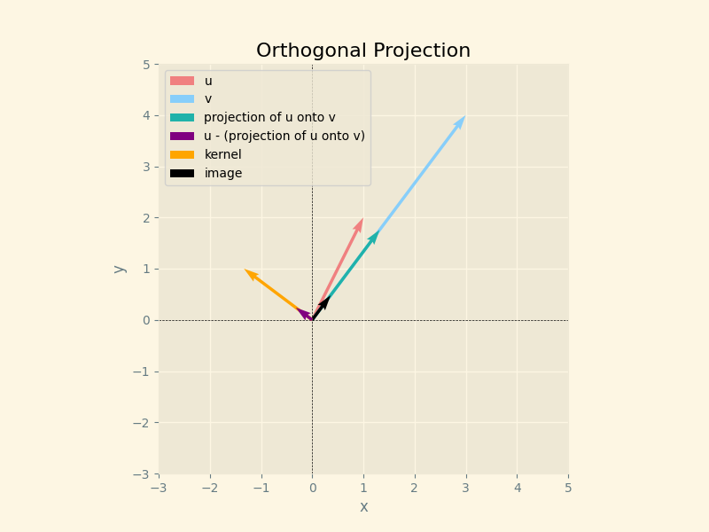

### Hilbert Space

#### Lᵖ

The set of square-integrable functions forms a Hilbert space.

```python
from sympy import *

x, n = symbols("x n")
f, g = symbols("f g", cls=Function)

p = 2
a = 0
b = 1
u = 3

is_in_lp2 = integrate(abs(f(x)) ** p, (x, a, b)) < oo

any_cauchy_sequence_fn = exp(x) / sqrt(n)
any_f_limit = limit(any_cauchy_sequence_fn, n, oo)
riesz_fischer_theorem = is_in_lp2.subs({f(x): any_f_limit})

is_lp2_complete = riesz_fischer_theorem
assert is_lp2_complete

fx = sin(x)
gx = cos(x)
hx = exp(x)

assert (
    is_in_lp2.subs({f(x): fx})
    and is_in_lp2.subs({f(x): gx})
    and is_in_lp2.subs({f(x): hx})
)

scalar_product_lp2 = integrate(f(x) * g(x), (x, a, b))

is_symmetric = scalar_product_lp2.subs({f(x): fx, g(x): gx}) == scalar_product_lp2.subs(
    {f(x): gx, g(x): fx}
)

is_additive = scalar_product_lp2.subs({f(x): fx + gx, g(x): hx}).evalf() == (
    scalar_product_lp2.subs({f(x): fx, g(x): hx}).evalf()
    + scalar_product_lp2.subs({f(x): gx, g(x): hx}).evalf()
)

is_scalar_multiplication = (
    scalar_product_lp2.subs({f(x): u * fx, g(x): gx}).evalf()
    == u * scalar_product_lp2.subs({f(x): fx, g(x): gx}).evalf()
)

is_positive = (
    scalar_product_lp2.subs({f(x): fx, g(x): fx}).evalf() >= 0
    and scalar_product_lp2.subs({f(x): 0, g(x): 0}).evalf() == 0
)

is_scalar_product = (
    is_symmetric and is_additive and is_scalar_multiplication and is_positive
)
assert is_scalar_product

is_hilbert_space = is_lp2_complete and is_scalar_product
assert is_hilbert_space
```

#### Pythagorean Theorem

In a Hilbert space when two vectors are orthogonal the norm satisfies the Pythagorean theorem.

```python
from sympy import *

x, a, b, c = symbols("x a b c")
f, g = symbols("f g", cls=Function)

scalar_product_lp2 = integrate(f(x) * g(x), (x, 0, pi))
norm_lp2 = sqrt(scalar_product_lp2.subs({f(x): f(x), g(x): f(x)}))

fx = sin(x)
gx = cos(x)

is_orthogonal = (
    abs(scalar_product_lp2.subs({f(x): fx, g(x): gx}).evalf() - 0.0) < 1e-100
)
assert is_orthogonal

a = norm_lp2.subs({f(x): fx}).evalf()
b = norm_lp2.subs({f(x): gx}).evalf()
c = norm_lp2.subs({f(x): fx + gx}).evalf()

is_pythagorean = a**2 + b**2 == c**2
assert is_pythagorean
```

#### Gram–Schmidt Process

The Gram-Schmidt process transforms a set of linearly independent vectors into an orthogonal set,
which is applied in QR decomposition, where Q is an orthonormal matrix and R an upper triangular matrix.

```python
from sympy import *

a1 = Matrix([1, 1, 1])
a2 = Matrix([1, 0, 2])
a3 = Matrix([1, 1, 3])

A = Matrix.hstack(a1, a2, a3)

is_linearly_independent = A.shape[1] == A.rank()
assert is_linearly_independent

u1 = a1
e1 = u1 / u1.norm()

projection_a2_onto_u1 = (a2.dot(u1) / u1.norm() ** 2) * u1
u2 = a2 - projection_a2_onto_u1
e2 = u2 / u2.norm()

projection_a3_onto_u1 = (a3.dot(u1) / u1.norm() ** 2) * u1
projection_a3_onto_u2 = (a3.dot(u2) / u2.norm() ** 2) * u2
u3 = a3 - projection_a3_onto_u1 - projection_a3_onto_u2
e3 = u3 / u3.norm()

is_orthogonal = e1.dot(e2) == e1.dot(e3) == e2.dot(u3) == 0
assert is_orthogonal

Q = Matrix.hstack(e1, e2, e3)

R = zeros(3, 3)
R[0, 0] = e1.dot(a1)
R[1, 1] = e2.dot(a2)
R[2, 2] = e3.dot(a3)
R[0, 1] = e1.dot(a2)
R[0, 2] = e1.dot(a3)
R[1, 2] = e2.dot(a3)

is_orthonormal = Q.T * Q == eye(3)
assert is_orthonormal

is_upper_triangular = R.is_upper
assert is_upper_triangular

is_qr_decomposition = A == Q * R
assert is_qr_decomposition
```

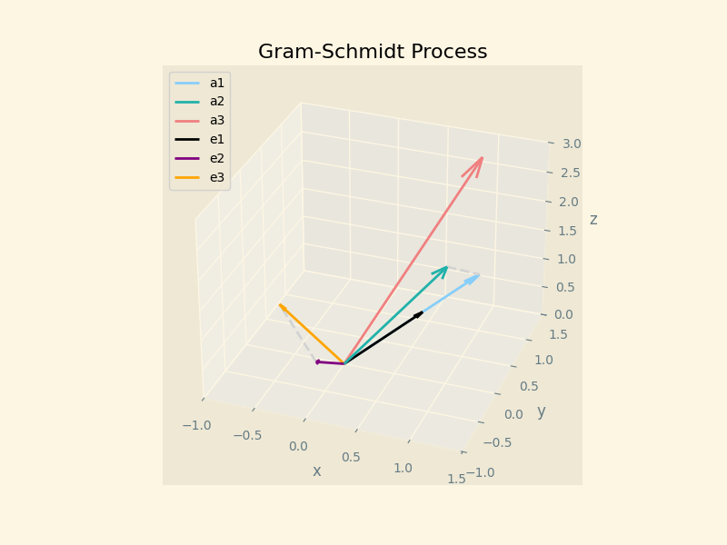

#### Hilbert-Schmidt Integral Operator

Hilbert-Schmidt integral operators are compact and become self-adjoint if the kernel is Hermitian.

```python
from sympy import *

x, y, mu = symbols("x y mu", real=True)
n = symbols("n", positive=True)
K, f, g = symbols("K f g", cls=Function)

a = 0
b = 1
p = 2
kernel = exp(x + y)

is_hilbert_schmidt_kernel = integrate(abs(K(x, y)) ** 2, (x, a, b), (y, a, b)) < oo
assert is_hilbert_schmidt_kernel.subs({K(x, y): kernel}).doit()

integral_operator = integrate(K(x, y) * f(y), (y, a, b))
hilbert_schmidt_integral_operator = integral_operator.subs({K(x, y): kernel})

any_bounded_sequence = sin(y * n)
exist_constant = 0

is_in_lp2 = integrate(abs(f(y)) ** p, (y, a, b)) < oo
assert is_in_lp2.subs({f(y): any_bounded_sequence}).doit()

is_compact = (
    limit(
        hilbert_schmidt_integral_operator.subs({f(y): any_bounded_sequence}).doit(),
        n,
        oo,
    )
    == hilbert_schmidt_integral_operator.subs({f(y): exist_constant}).doit()
)
assert is_compact

is_hermitian = conjugate(kernel) == kernel
assert is_hermitian

scalar_product_lp2 = integrate(f(x) * g(x), (x, a, b))

is_self_adjoint = (
    scalar_product_lp2.subs(
        {f(x): hilbert_schmidt_integral_operator.subs({f(y): sin(y)}), g(x): cos(x)}
    ).doit()
    == scalar_product_lp2.subs(
        {f(x): hilbert_schmidt_integral_operator.subs({f(y): cos(y)}), g(x): sin(x)}
    ).doit()
)
assert is_self_adjoint
```

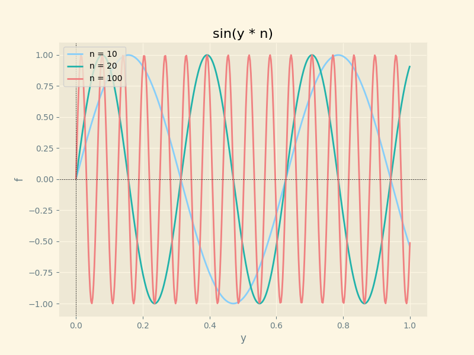
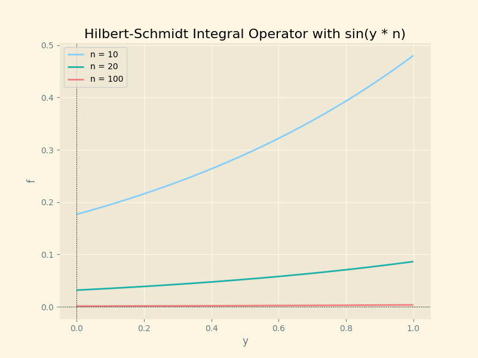
